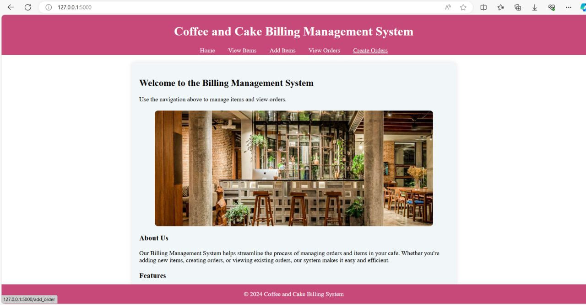
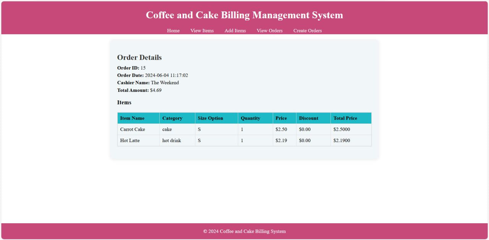

# Data Analyst | Data Scientist

**Technical Skills:** Python, Microsoft Excel, Power BI, SQL, MySQL, Data Analysis, Statistical Analysis & Modeling, Machine Learning  

---

###  **1. Coffee and Bakery Billing Management System** 
**Tech Stack:**  
 
  

**Objective:** The goal is to create a practical and efficient cashier system **(POS)** for a coffee shop, leveraging the MySQL database for data storage and the Flask web framework for the application logic and user interface.  

**Results**:   
    
    

**🔗 [GitHub Repository](https://github.com/MaoKimlang/Coffee-and-Bakery-Billing-Management-System-Project)**

