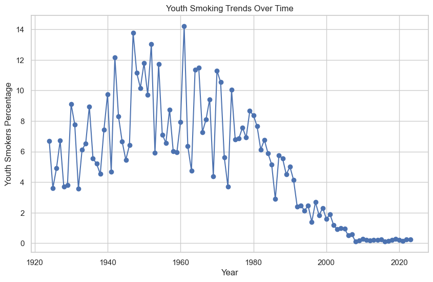

# Data Analyst | Data Scientist

**Technical Skills:** Python, Microsoft Excel, Power BI, SQL, MySQL, Data Analysis, Statistical Analysis & Modeling, Machine Learning  

---

## Project

###  **1. Coffee and Bakery Billing Management System** 
**Tech Stack:**  
 
  

**Objective:** The goal is to create a practical and efficient cashier system **(POS)** for a coffee shop, leveraging the MySQL database for data storage and the Flask web framework for the application logic and user interface.  

**Results:**   
    
    

**🔗 [GitHub Repository](https://github.com/MaoKimlang/Coffee-and-Bakery-Billing-Management-System-Project)**  

###  **2. Years of Smoking Trends Prediction and Comparative** 

**Tech Skill:**             

**Objective:** The objective of the project is to analyze global smoking trends over the past century (1924-2023) and identify patterns make predictions, and draw comparisons to understand the evaluation of smoking habits wordwide.

**Dataset:** The dataset got from [Kaggle](https://www.kaggle.com/datasets/mitul1999/100-years-of-smoking-global-trends-1924-2023/code), which contains historical data on smoking habits, including percentages of smoking populations, related deaths, healthcare costs, and more.

**Results:**
- Smoking Trends Over the Years
 In 1940 to 1960 :The trends in youth smoking percentages, with several spikers reaching around 12%-14% and 2000-2023 youth smoking percentages have remained low and relatively stable, fluctuating around 2% or less. The sustained low rates suggest the continuing effectiveness of public health efforts and legislative measures in reducing youth smoking.

**🔗 [GitHub Repository](https://github.com/MaoKimlang/Years-of-Smoking-Trends-Predictive-and-Comparative-)**  
